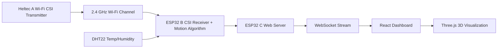

# Architecture

## System view

WiFiGhost should be organized as a measurement pipeline with explicit boundaries between radio capture, transport, analysis, and presentation.

## Responsibilities

### Heltec A: Transmitter

- Emits controlled Wi-Fi traffic
- Keeps packet timing as stable as possible
- Provides a repeatable excitation source for the channel

### ESP32 B: Receiver and Motion Node

- Captures CSI and packet metadata
- Reads ambient temperature and humidity from a DHT22 on the same node
- Runs the first-stage motion algorithm
- Applies first-stage filtering and serialization

Recommended DHT22 wiring on a regular ESP32 WROOM-32:

- `VCC` -> `3V3`
- `GND` -> `GND`
- `DATA` -> `GPIO4`

`GPIO5` is acceptable if `GPIO4` is unavailable. Avoid `GPIO0`, `GPIO2`, `GPIO12`, `GPIO15`, `GPIO1`, `GPIO3`, and `GPIO6` through `GPIO11`.

### ESP32 C: Dashboard Server

- Hosts the web server
- Serves the React dashboard
- Publishes capture data over WebSocket
- Keeps dashboard duties separate from CSI capture

### Frontend

- Displays raw and normalized channel state
- Shows temporal trends and confidence indicators
- Presents the environment as a research instrument, not just a demo scene

## Data model

Use a payload that separates raw and derived data:

- `timestamp`
- `device_id`
- `sequence_number`
- `rssi`
- `csi_amplitude[]`
- `csi_phase[]`
- `channel`
- `rate`
- `temperature_c`
- `humidity_percent`
- `normalized_features`
- `anomaly_score`
- `motion_score`
- `state`

The canonical payload contract is documented in [canonical-payload.schema.json](canonical-payload.schema.json).

## Research engineering principle

Every layer should be testable independently.

- Hardware capture can be validated against known packet streams.
- Compensation can be validated on quiet-room baselines.
- Visualization can be validated on synthetic and recorded data.
- The end-to-end pipeline can then be evaluated as a system, not as a UI prototype.

## References

- [ESP-IDF Wi-Fi CSI guide](https://docs.espressif.com/projects/esp-idf/en/latest/esp32/api-guides/wifi.html#wi-fi-channel-state-information)
- [Espressif esp-csi repository](https://github.com/espressif/esp-csi)
- [esp-csi esp-radar examples](https://github.com/espressif/esp-csi/tree/master/examples/esp-radar)
- [Wireless Channel Fundamentals](https://github.com/espressif/esp-csi/blob/master/docs/en/Wireless-Channel-Fundamentals.md)
